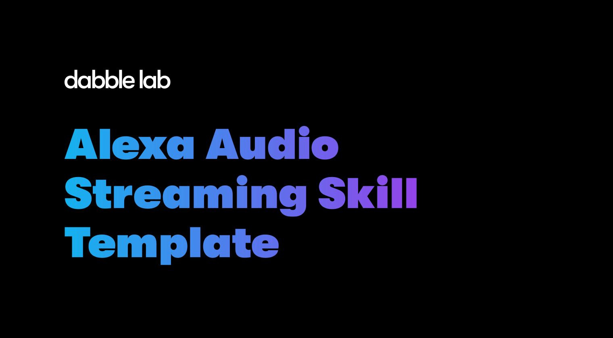

# Alexa Audio Streaming Skill Template

This is an Alexa skill template that provides example code for playing an audio stream. 

### Live example
There is a live example of this skill that you can try from your Alexa device. Just enable the [Dabble Radio Alexa skill](https://www.amazon.com/Dabble-Lab-Radio/dp/B07JYWFGZ1). You can do that by saying: `Alexa, enable Dabble Radio` and then `Alexa, open Dabble Radio`.

The live skill and this template play a stream that was setup on [zeno.fm](http://stream.zeno.fm/efe91skxn18uv). However, the template will work with any stream that meets the Alexa audio format guidelines. See the [Alexa documentation](https://developer.amazon.com/en-US/docs/alexa/alexa-voice-service/audioplayer.html) for more information.

### Using this skill template

1. If you don't have one already, create an [Amazon Developer account](https://developer.amazon.com/).

2. Click the button below to deploy the code for this skill into your Alexa developer account. 

    

3. In the Alexa developer console, set the skill's invocation name.

4. Test the skill with and Alexa device that can play audio. 
    > **NOTE:** You can't test audio skill with the Alexa simulator.

5. Modify the skill code to use your own stream URL.